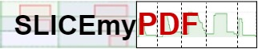
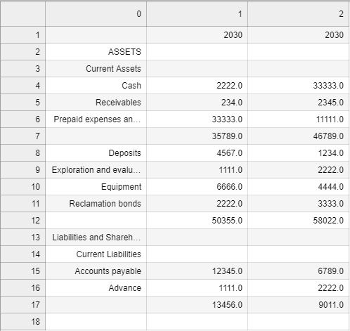
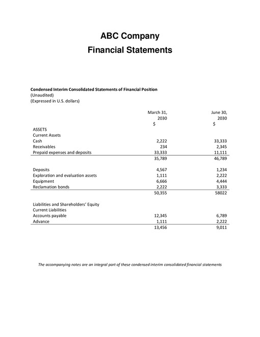
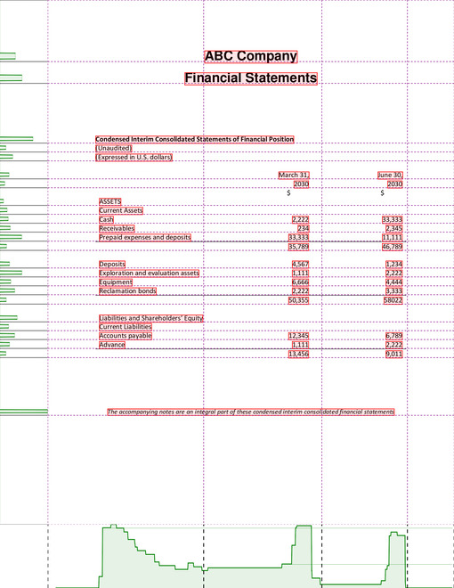

[(Français)](#le-nom-du-projet)



## SLICEmyPDF

This project uses SLICE algorithm to extract information from a text-based PDF page containing financial statements (tabular data). It can also be used to extract regular tables but will contain all text on a page. 


## SLICE - Spatial Layout based Information and Content Extraction

SLICE algorithm is a unique computer vision algorithm that simultaneously uses textual, visual and layout information to segment several datapoints into a tabular structure. It uses pixels to determine ideal page divisions and map the entire page into several rectangular subsections. Once mapped, each token becomes a member of a subsection that it intersects. 

It was designed and developed within Statistics Canada.


### Setup Instructions

```
conda env create -f environment.yml
source activate conda-slicemypdf
```

**IMPORTANT!**

Update settings.yaml dependencies path depending on your environment:
```
pdf_text_path: "/opt/conda/envs/conda-slicemypdf/bin/pdftotext"
pdf_html_path: "/opt/conda/envs/conda-slicemypdf/bin/pdftohtml"
```

### Usage Instructions

#### Basic Usage:

Extract table information from a text-based PDF. Provide path to pdf file and page number to be extracted to the Extractor object. Extracted table returned as Pandas Dataframe.
```python
from slicemypdf import Extractor

table = Extractor(pdf_loc="path/filename.pdf", page=1)
extracted_table = table.extract(FS_flag=True)
# Save dataframe to .csv file
output_filename = "path/filename.csv"
extracted_table.to_csv(output_filename, index=None, header=True)
```



#### View page that will be processed:

To check if page number is correct. Provide path to pdf file and page number to be extracted to the Extractor object. Image of the page (unprocessed) returned.
```python
from slicemypdf import Extractor

table = Extractor(pdf_loc="path/filename.pdf", page=1)
page_img = table.get_pageview()
# Save image as .jpg
table.save_image(img=page_img, file_name="path/filename.jpg")
```



#### View page with row and column divisions:

To check if page is sectioned correctly. Provide path to pdf file and page number to be extracted to the Extractor object. Image of the page (processed) returned.
```python
from slicemypdf import Extractor

table = Extractor(pdf_loc="path/filename.pdf", page=1)
page_img = table.get_gridview()
```



#### Check out instructions.ipynb for more information on how to use this code!


### How to Contribute

See [CONTRIBUTING.md](CONTRIBUTING.md)

### License

Unless otherwise noted, the source code of this project is covered under Crown Copyright, Government of Canada, and is distributed under the [MIT License](LICENSE).

The Canada wordmark and related graphics associated with this distribution are protected under trademark law and copyright law. No permission is granted to use them outside the parameters of the Government of Canada's corporate identity program. For more information, see [Federal identity requirements](https://www.canada.ca/en/treasury-board-secretariat/topics/government-communications/federal-identity-requirements.html).

______________________

## SLICEmyPDF

### Comment contribuer

Voir [CONTRIBUTING.md](CONTRIBUTING.md)

### Licence

Sauf indication contraire, le code source de ce projet est protégé par le droit d'auteur de la Couronne du gouvernement du Canada et distribué sous la [licence MIT](LICENSE).

Le mot-symbole « Canada » et les éléments graphiques connexes liés à cette distribution sont protégés en vertu des lois portant sur les marques de commerce et le droit d'auteur. Aucune autorisation n'est accordée pour leur utilisation à l'extérieur des paramètres du programme de coordination de l'image de marque du gouvernement du Canada. Pour obtenir davantage de renseignements à ce sujet, veuillez consulter les [Exigences pour l'image de marque](https://www.canada.ca/fr/secretariat-conseil-tresor/sujets/communications-gouvernementales/exigences-image-marque.html).